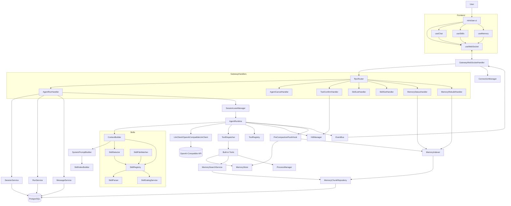
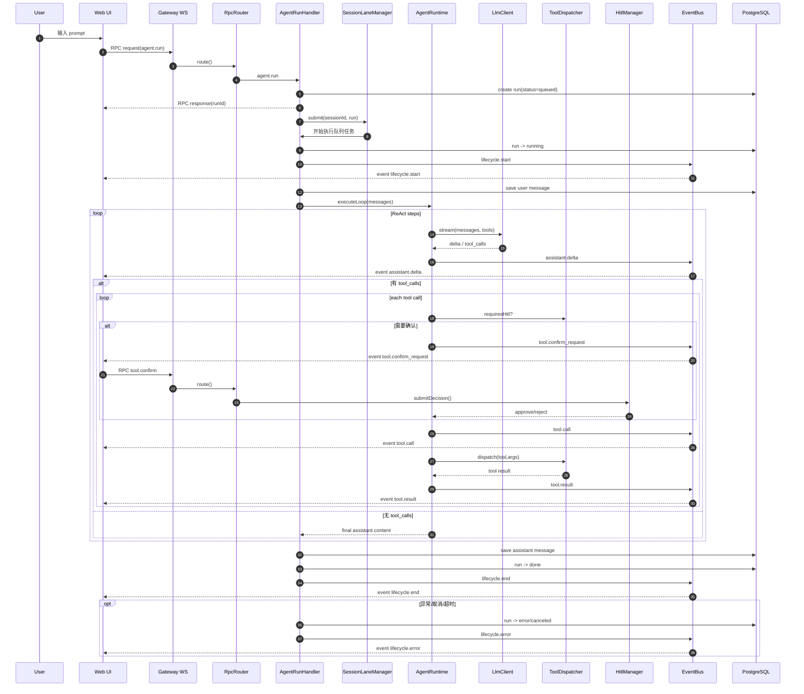

# MiniClaw Agent 启动前置文档

> 最后更新：2026-02-06
> 适用范围：当前工作区 `miniclaw`（后端 `src` + 前端 `miniclaw-ui`）

## 1. 文档目标

本文件用于后续每次启动时，快速建立统一上下文：

- 项目核心设计与边界
- 当前实际架构（以代码为准）
- 实现进度（按 Phase）
- 模块依赖关系图
- `agent.run` 主链路时序图

---

## 2. 核心设计（Design Principles）

MiniClaw 是 OpenClaw 的 Java 学习版复刻，目标是做出可教学、可运行、可扩展的 Agent 系统。

核心原则：

1. **分层清晰**：Control / Execution / Extension / State / Automation
2. **主链路优先**：先打通 `agent.run`，再逐步扩展工具、技能、记忆
3. **可观测性**：以事件流（`lifecycle.*`, `assistant.delta`, `tool.*`, `skill.*`）驱动前端展示
4. **安全执行**：工具调用支持白名单与 HITL（人工确认）
5. **记忆工程**：Markdown 为真相源，数据库为可重建索引

---

## 3. 当前架构（As-Is）

### 3.1 分层架构

- **Control Plane**
  - WebSocket 接入：`/ws`
  - RPC 分发：`RpcRouter`
  - 事件推送：`EventBus` + `ConnectionManager`

- **Execution Plane**
  - 主执行器：`AgentRuntime`（ReAct 多步循环）
  - 队列与并发：`SessionLaneManager`（同会话串行、跨会话并行）
  - 上下文与系统提示：`ContextBuilder` / `SystemPromptBuilder`
  - 运行控制：`LoopConfig` / `RunContext` / `CancellationManager`

- **Extension Plane**
  - 工具：`ToolRegistry` / `ToolDispatcher`
  - HITL：`HitlManager` + `tool.confirm`
  - 技能：`SkillRegistry` + `SkillParser` + `SkillGatingService` + `SkillSelector` + `SkillFileWatcher`

- **State Plane**
  - PostgreSQL：`sessions` / `runs` / `messages` / `memory_chunks`
  - JPA Repository + Flyway 迁移
  - 记忆文件：`workspace/memory/*.md`

- **Automation Plane**
  - 设计目标是 Quartz/Cron；当前代码库尚未看到对应落地模块

### 3.2 前端架构

- **Workspace**（核心对话页）
  - `useWebSocket`：RPC 请求与事件订阅
  - `useChat`：会话/消息/流式块/工具确认/取消
  - 组件：`MessageList`, `ToolCallCard`, `SkillActivationCard`, `MessageInput`

- **Settings**（配置视图）
  - Skills：`skills.list` / `skills.get`
  - Memory：`memory.status` / `memory.rebuild`

---

## 4. 模块依赖图（Module Dependency）

---

## 5. 主链路时序图（`agent.run`）

---

## 6. 当前实现进度（截至 2026-02-06）

| Phase | 状态 | 说明 |
|---|---|---|
| Phase 1 基础主链路 | ✅ 已完成 | WS/RPC、Session/Run/Message 持久化、流式输出、基础前端对话已落地 |
| Phase 2 ReAct + 工具 | ✅ 已完成（并扩展） | Function Calling、多步循环、HITL、工具事件、异步 shell 工具族已落地 |
| Phase 3 Skills | ✅ 高完成度 | 解析/Gating/注册/热更新/索引/选择/RPC/前端列表详情已落地 |
| Phase 4 Memory | ✅ 高完成度 | 全局记忆存储、索引、检索、status/rebuild RPC、预压缩 flush 已落地 |
| Phase 5 Cron + 客户端完善 | ⏳ 部分进行中 | 前端设置页持续完善；Cron/CLI 未在当前代码中看到完整落地 |

---

## 7. 已知差异与待补项

1. **Cron 模块差异**
   - 设计文档与 README 提到 Cron 能力
   - 当前 `src/main/java/com/jaguarliu/ai` 下未见 `cron` 相关实现目录

2. **`memory_get` 差异**
   - 设计中包含 `memory_get`
   - 当前工具实现可见 `memory_search` / `memory_write`，`memory_get` 未落地

3. **手动 Slash Skill 触发链路待确认**
   - `ContextBuilder` 提供 `buildSmart()`（含手动 `/skill` 解析）
   - `AgentRunHandler` 当前主路径使用 `buildMessages()`，需评估是否完全接入手动触发路径

---

## 8. 启动阅读顺序（推荐）

1. `docs/plans/2026-02-02-miniclaw-design.md`（全局设计）
2. `src/main/java/com/jaguarliu/ai/gateway/rpc/handler/AgentRunHandler.java`（入口）
3. `src/main/java/com/jaguarliu/ai/runtime/AgentRuntime.java`（ReAct 核心）
4. `src/main/java/com/jaguarliu/ai/tools/ToolDispatcher.java`（工具执行与安全）
5. `src/main/java/com/jaguarliu/ai/skills/registry/SkillRegistry.java`（技能系统）
6. `src/main/java/com/jaguarliu/ai/memory`（记忆系统）
7. `miniclaw-ui/src/composables/useChat.ts`（前端事件编排）

---

## 9. 使用建议

当后续继续开发时，建议优先按以下顺序推进：

1. 补齐 `Phase 5` 的 Cron 与 CLI 最小闭环
2. 对齐 `memory_get` 工具能力与系统提示/文档
3. 核查并打通手动 `/skill` 在 `agent.run` 主链路的完整路径
4. 增加端到端验证脚本（从 `agent.run` 到工具/HITL/记忆回写）

