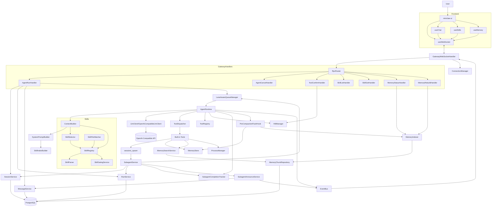

# MiniClaw Agent 启动前置文档

> 最后更新：2026-02-07
> 适用范围：当前工作区 `miniclaw`（后端 `src` + 前端 `miniclaw-ui`）

## 1. 文档目标

本文件用于后续每次启动时，快速建立统一上下文：

- 项目核心设计与边界
- 当前实际架构（以代码为准）
- 实现进度（按 Phase）
- 模块依赖关系图
- `agent.run` 主链路时序图

---

## 2. 核心设计（Design Principles）

MiniClaw 是 OpenClaw 的 Java 学习版复刻，目标是做出可教学、可运行、可扩展的 Agent 系统。

核心原则：

1. **分层清晰**：Control / Execution / Extension / State / Automation
2. **主链路优先**：先打通 `agent.run`，再逐步扩展工具、技能、记忆
3. **可观测性**：以事件流（`lifecycle.*`, `assistant.delta`, `tool.*`, `skill.*`）驱动前端展示
4. **安全执行**：工具调用支持白名单与 HITL（人工确认）
5. **记忆工程**：Markdown 为真相源，数据库为可重建索引

---

## 3. 当前架构（As-Is）

### 3.1 分层架构

- **Control Plane**
  - WebSocket 接入：`/ws`
  - RPC 分发：`RpcRouter`
  - 事件推送：`EventBus` + `ConnectionManager`

- **Execution Plane**
  - 主执行器：`AgentRuntime`（ReAct 多步循环 + SubAgent 屏障）
  - 队列与并发：`LaneAwareQueueManager`（双层队列：session 串行 + main/subagent lane 限并发）
  - 上下文与系统提示：`ContextBuilder` / `SystemPromptBuilder`
  - 运行控制：`LoopConfig` / `RunContext` / `CancellationManager`
  - 子代理编排：`SubagentService` / `SubagentAnnounceService` / `SubagentCompletionTracker`

- **Extension Plane**
  - 工具：`ToolRegistry` / `ToolDispatcher`
  - HITL：`HitlManager` + `tool.confirm`
  - 技能：`SkillRegistry` + `SkillParser` + `SkillGatingService` + `SkillSelector` + `SkillFileWatcher`

- **State Plane**
  - PostgreSQL：`sessions` / `runs` / `messages` / `memory_chunks`（含 `session_kind` / `parent_session_id` / `run_kind` / `lane` 等 SubAgent 字段）
  - JPA Repository + Flyway 迁移（V3 SubAgent schema 扩展）
  - 记忆文件：`workspace/memory/*.md`

- **Automation Plane**
  - 设计目标是 Quartz/Cron；当前代码库尚未看到对应落地模块

### 3.2 前端架构

- **Workspace**（核心对话页）
  - `useWebSocket`：RPC 请求与事件订阅
  - `useChat`：会话/消息/流式块/工具确认/取消/SubAgent 面板控制
  - `useSubagent`：子代理运维 RPC（list/stop/send）
  - 组件：`MessageList`, `ToolCallCard`, `SkillActivationCard`, `SubagentCard`, `SubagentPanel`, `MessageInput`
  - 布局：三栏式（侧边栏 / 主聊天 / SubAgentPanel 右侧面板）

- **Settings**（配置视图）
  - Skills：`skills.list` / `skills.get`
  - Memory：`memory.status` / `memory.rebuild`

---

## 4. 模块依赖图（Module Dependency）



---

## 5. 主链路时序图（`agent.run`）


---

## 6. 当前实现进度（截至 2026-02-07）

| Phase | 状态 | 说明 |
|---|---|---|
| Phase 1 基础主链路 | ✅ 已完成 | WS/RPC、Session/Run/Message 持久化、流式输出、基础前端对话已落地 |
| Phase 2 ReAct + 工具 | ✅ 已完成（并扩展） | Function Calling、多步循环、HITL、工具事件、异步 shell 工具族已落地 |
| Phase 3 Skills | ✅ 高完成度 | 解析/Gating/注册/热更新/索引/选择/RPC/前端列表详情已落地 |
| Phase 4 Memory | ✅ 高完成度 | 全局记忆存储、索引、检索、status/rebuild RPC、预压缩 flush 已落地 |
| Phase 5 Cron + 客户端完善 | ⏳ 部分进行中 | 前端设置页持续完善；Cron/CLI 未在当前代码中看到完整落地 |
| Phase SA SubAgent | ✅ 已完成 | spawn/announce/barrier/双层队列/前端面板/会话隔离已落地 |

---

## 7. SubAgent 子代理系统

### 7.1 概述

SubAgent 使主 Agent 能将子任务异步派生到独立子会话执行，并在完成后自动回传结果。主循环通过屏障机制等待所有子代理完成后，由 LLM 汇总输出。

### 7.2 核心组件

| 组件 | 职责 |
|------|------|
| `SessionsSpawnTool` | 内置工具，LLM 通过 `sessions_spawn` 发起派生（禁止嵌套） |
| `SubagentService` | 编排 spawn 全流程：创建子会话/运行 → 注册 Future → 提交异步执行 |
| `SubagentAnnounceService` | 子代理完成后回传结果到父会话（JSON 持久化 + 事件推送） |
| `SubagentCompletionTracker` | `ConcurrentHashMap<subRunId, CompletableFuture>` 跟踪器 |
| `SubagentOpsService` | 运维 RPC：`subagent.list` / `subagent.stop` / `subagent.send` |
| `AgentRuntime` (barrier) | 检测 pending subRunIds → 等待 Future → 注入结果 → 继续循环让 LLM 汇总 |
| `LaneAwareQueueManager` | 双层队列：session 串行 + `main`/`subagent` lane 独立并发配额 |
| `EventBus` | `busyLooping` 策略处理多 subagent 线程并发 emit |

### 7.3 执行时序

```
1. 用户发消息 → 主 Agent ReAct 循环
2. LLM 调用 sessions_spawn(task, ...)
3. SubagentService.spawn():
   a. 创建子会话 (session_kind=subagent)
   b. 创建子运行 (run_kind=subagent, lane=subagent)
   c. CompletionTracker.register(subRunId) 注册 Future
   d. 提交到 subagent lane 异步执行
   e. 返回 { subSessionId, subRunId } 给 LLM
4. 子代理在独立会话执行 ReAct 循环
5. 主循环检测到 LLM 无工具调用 且 pendingSubRunIds 非空
   → 进入屏障：waitForPendingSubagents()
6. 子代理完成 → CompletionTracker.complete() 解锁 Future
   → AnnounceService 将结果写入父会话 + 推送事件
7. 主循环收到所有结果 → 注入为 user 消息 → LLM 汇总输出
```

### 7.4 双层队列

```
Global Lane（外层）
├── main lane    ── 并发上限 4
└── subagent lane ── 并发上限 8

Session Lane（内层）
└── 每个 sessionId 严格串行
```

### 7.5 安全约束

- 禁止嵌套派生：`run_kind=subagent` 调用 `sessions_spawn` 直接拒绝
- 工具收口：subagent 默认不可使用 `sessions_spawn`
- 并发隔离：subagent lane 独立配额，不影响主交互
- 会话隔离：子代理运行于独立 session，不污染父会话上下文

### 7.6 事件流

| 事件 | 触发时机 |
|------|----------|
| `subagent.spawned` | 子代理创建成功 |
| `subagent.started` | 子代理开始执行 |
| `subagent.announced` | 子代理完成，结果回传 |
| `subagent.failed` | 子代理执行失败 |

子代理内部的 `assistant.delta` / `tool.call` / `tool.result` 按 `runId` 路由到前端 SubagentPanel。

### 7.7 前端 UX

- **SubagentCard**：主聊天中显示为可点击卡片（任务、状态、耗时、步骤数）
- **SubagentPanel**：右侧 480px 面板，渲染选中子代理的 tool calls 和文本（类 Claude Artifacts）
- **三栏布局**：`SessionSidebar | 主聊天 | SubagentPanel`
- **会话过滤**：侧边栏仅显示 `session_kind=main` 的会话
- **Announce 转化**：页面刷新后，`subagent_announce` JSON 消息被前端 `loadMessages` 转化为 SubagentCard 块

### 7.8 数据模型扩展

**sessions 新增字段**：`session_kind`, `parent_session_id`, `created_by_run_id`, `agent_id`

**runs 新增字段**：`run_kind`, `lane`, `parent_run_id`, `requester_session_id`, `deliver`

### 7.9 设计文档

- 详细设计：`docs/plans/2026-02-06-subagent-design.md`
- 实现计划：`docs/plans/2026-02-06-subagent-implementation-plan.md`

---

## 8. 已知差异与待补项

1. **Cron 模块差异**
   - 设计文档与 README 提到 Cron 能力
   - 当前 `src/main/java/com/jaguarliu/ai` 下未见 `cron` 相关实现目录

2. **`memory_get` 差异**
   - 设计中包含 `memory_get`
   - 当前工具实现可见 `memory_search` / `memory_write`，`memory_get` 未落地

3. **手动 Slash Skill 触发链路待确认**
   - `ContextBuilder` 提供 `buildSmart()`（含手动 `/skill` 解析）
   - `AgentRunHandler` 当前主路径使用 `buildMessages()`，需评估是否完全接入手动触发路径

---

## 9. 启动阅读顺序（推荐）

1. `docs/plans/2026-02-02-miniclaw-design.md`（全局设计）
2. `src/main/java/com/jaguarliu/ai/gateway/rpc/handler/AgentRunHandler.java`（入口）
3. `src/main/java/com/jaguarliu/ai/runtime/AgentRuntime.java`（ReAct 核心 + SubAgent 屏障）
4. `src/main/java/com/jaguarliu/ai/tools/ToolDispatcher.java`（工具执行与安全）
5. `src/main/java/com/jaguarliu/ai/skills/registry/SkillRegistry.java`（技能系统）
6. `src/main/java/com/jaguarliu/ai/memory`（记忆系统）
7. `src/main/java/com/jaguarliu/ai/subagent/SubagentService.java`（子代理编排）
8. `miniclaw-ui/src/composables/useChat.ts`（前端事件编排 + SubAgent 面板控制）

---

## 10. 使用建议

当后续继续开发时，建议优先按以下顺序推进：

1. 补齐 `Phase 5` 的 Cron 与 CLI 最小闭环
2. 对齐 `memory_get` 工具能力与系统提示/文档
3. 核查并打通手动 `/skill` 在 `agent.run` 主链路的完整路径
4. 增加端到端验证脚本（从 `agent.run` 到工具/HITL/记忆回写）

