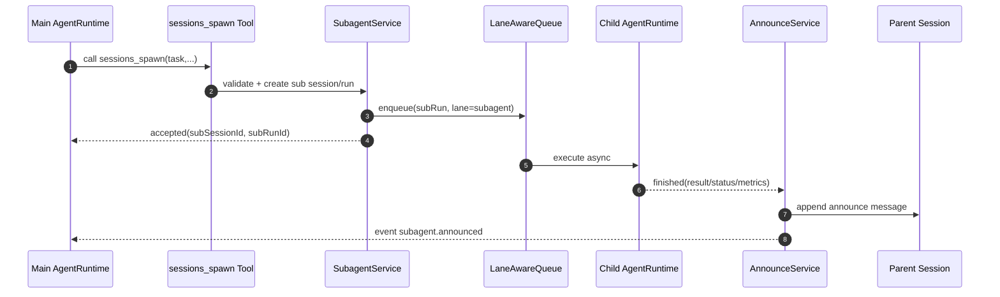

# MiniClaw SubAgent 系统设计（2026-02-06）

> 状态：Design Ready（可进入实现分解）
> 关联范围：后端优先；`cron` 与前端 UI 暂时后置

---

## 1. 背景与目标

当前 MiniClaw 由单主 Agent 承担所有执行工作，面对以下任务时会出现瓶颈：

- 长耗时任务（如大规模检索、长链路分析）阻塞主会话响应
- 可并行任务（多源新闻采集、舆情多维分析、机器巡检）无法并发展开
- 单会话上下文过载，不利于任务隔离与回溯

本设计目标：在现有架构上引入 **SubAgent 派生执行能力**，使主 Agent 能将子任务异步外包到独立子会话执行，并在完成后自动回传结果。

---

## 2. 术语定义

- **Main Agent**：用户当前直接对话的主执行 Agent
- **SubAgent**：由主运行中派生出的子执行体，运行于独立 session
- **Agent Profile**：一个可配置的 Agent 身份（工具权限、工作目录、沙箱、凭据策略）
- **Main Lane / Subagent Lane**：全局并发池中的两类执行通道
- **Session Lane**：按 `sessionId` 串行的队列，保证单 session 同时仅一个 run 执行

---

## 3. 范围与非目标

### 3.1 本次范围（In Scope）

1. 支持 `sessions_spawn` 工具派生 SubAgent
2. SubAgent 独立 session + 独立 run + 异步执行
3. 双层队列：`session 串行` + `global lane 限并发`
4. 子任务完成后自动 announce 回父会话
5. 子任务运维能力（list/stop/send 的后端 RPC）
6. 安全边界：禁止嵌套 spawn、默认工具收口、按 agentId 权限隔离

### 3.2 暂不包含（Out of Scope）

- Cron 与 SubAgent 的自动调度融合
- 前端 `/subagents` 运维界面
- 多租户权限系统（保持单用户个人助手假设）

---

## 4. 设计原则

1. **增量演进**：复用现有 `AgentRuntime` / `RunService` / `SessionLaneManager`，避免重写
2. **任务隔离**：SubAgent 必须在独立 session 中运行，避免上下文污染
3. **并发可控**：同会话严格串行，跨会话按 lane 配额并行
4. **可回传可追溯**：每个派生任务可追踪父子关系、耗时、状态
5. **安全优先**：默认禁止嵌套派生，子代理默认收口敏感会话工具

---

## 5. 总体架构

```mermaid
graph TD
    User --> UI[miniclaw-ui]
    UI --> WS[GatewayWebSocketHandler]
    WS --> Router[RpcRouter]

    Router --> ARH[AgentRunHandler]
    ARH --> Runtime[AgentRuntime]
    Runtime --> ToolDispatcher[ToolDispatcher]
    Runtime --> Queue[LaneAwareQueueManager]

    ToolDispatcher --> SpawnTool[sessions_spawn]
    SpawnTool --> SubagentService[SubagentService]
    SubagentService --> SessionService[SessionService]
    SubagentService --> RunService[RunService]
    SubagentService --> Queue

    Queue --> ChildRuntime[AgentRuntime(Child)]
    ChildRuntime --> Announce[SubagentAnnounceService]
    Announce --> MessageService[MessageService]
    Announce --> EventBus[EventBus]

    SubagentService --> AgentRegistry[AgentRegistry]
    AgentRegistry --> AgentProfile[Agent Profiles]

    SessionService --> DB[(PostgreSQL)]
    RunService --> DB
    MessageService --> DB
```

---

## 6. 核心设计

### 6.1 Agent Profiles（多主 Agent 配置）

新增 `agents` 配置段，支持多个可选 agent 身份：

```yaml
agents:
  default-agent: main
  profiles:
    main:
      sandbox: trusted
      tools:
        allow: [read_file, write_file, shell, shell_start, shell_status, shell_kill, http_get, memory_search, memory_write, sessions_spawn]
        deny: []
      workspace: ./workspace
      auth-dir: ./.miniclaw/auth/main
    public:
      sandbox: restricted
      tools:
        allow: [read_file, http_get, memory_search]
        deny: [shell, write_file, sessions_spawn]
      workspace: ./workspace/public
      auth-dir: ./.miniclaw/auth/public
```

核心要求：

- 每个 run 必须绑定 `agentId`
- subagent 默认继承父 `agentId`，可显式指定其他可用 profile（受白名单限制）

### 6.2 Session / Run 模型扩展

为支持父子链路与 lane 调度，新增字段：

**sessions**（新增）

- `agent_id`
- `session_kind`：`main | subagent`
- `session_key`：如 `agent:main:subagent:<uuid>`
- `parent_session_id`（主会话）
- `created_by_run_id`（创建来源）

**runs**（新增）

- `agent_id`
- `run_kind`：`main | subagent`
- `lane`：`main | subagent`
- `parent_run_id`
- `requester_session_id`
- `deliver`（是否转发中间流）

### 6.3 双层队列（Lane-aware FIFO）

现有 `SessionLaneManager` 升级为双层模型：

1. **Session Lane（内层）**
   - Key：`sessionId`
   - 保证单 session 同时只执行一个 run

2. **Global Lane（外层）**
   - `main lane`：主会话请求
   - `subagent lane`：子会话请求
   - 配置独立并发上限（如 `main=4`, `subagent=8`）

调度策略：

- 同一 lane 内 FIFO
- session 冲突时必须等待
- subagent 不可抢占 main；main lane 配额优先保障交互实时性

### 6.4 `sessions_spawn` 语义

新增内置工具：`sessions_spawn`。

请求参数建议：

```json
{
  "task": "请并发采集过去24小时AI芯片新闻并归纳风险点",
  "agentId": "main",
  "deliver": false,
  "announce": true,
  "timeoutSeconds": 600,
  "metadata": {"topic":"ai-chip-news"}
}
```

返回：

```json
{
  "accepted": true,
  "subSessionId": "...",
  "subRunId": "...",
  "sessionKey": "agent:main:subagent:...",
  "lane": "subagent"
}
```

约束：

- **禁止嵌套**：`run_kind=subagent` 调用 `sessions_spawn` 直接拒绝
- `deliver=false` 默认不转发子任务中间流给父会话
- `announce=true` 默认在结束时回传摘要到父会话

### 6.5 Announce 回传机制

SubAgent 完成后执行回传步骤：

1. 将子任务结果打包为 announce 消息
2. 写入父 session（`role=assistant`，标记来源 `subagent`）
3. 推送事件 `subagent.announced`

建议携带元信息：

- `subSessionId`, `subRunId`, `sessionKey`
- `durationMs`, `status`, `error?`
- `estimatedTokens?`, `cost?`（后续可补）

---

## 7. 关键时序



---

## 8. 安全边界

1. **禁止递归派生**：subagent 不允许再次 spawn
2. **默认工具收口**：subagent 默认禁用会话级控制工具（`sessions_spawn`, `subagent.send` 等）
3. **Agent 级隔离**：按 `agentId` 解析 workspace/auth；允许父 auth 兜底合并，但不能越权
4. **并发隔离**：subagent lane 独立配额，避免拖垮主交互
5. **审计可追溯**：父子 run 关系可查询，错误可回放

---

## 9. 失败与恢复策略

### 9.1 失败场景

- spawn 参数非法/权限不符
- 子任务超时/取消/工具失败
- announce 回传失败（父 session 不可用）
- 服务重启导致子任务回传中断

### 9.2 恢复策略

- spawn 失败即时返回 ToolResult.error
- 子任务失败仍触发失败 announce（包含错误摘要）
- 新增 `subagent_outbox`（建议）持久化待回传消息，后台重试
- `subagent.list` 可查看状态，`subagent.send` 可继续接力

---

## 10. 可观测性与事件

新增事件建议：

- `subagent.spawned`
- `subagent.started`
- `subagent.announced`
- `subagent.failed`

日志字段建议统一包含：

- `runId`, `sessionId`, `agentId`, `runKind`, `lane`, `parentRunId`

---

## 11. 与当前代码的集成点

优先增量修改以下模块：

- `runtime`：`RunContext`, `AgentRuntime`, `SessionLaneManager`
- `session`：`SessionService`, `RunService`
- `tools`：新增 `sessions_spawn`，扩展 `ToolExecutionContext`
- `gateway/rpc`：新增 `subagent.list / subagent.stop / subagent.send`
- `storage`：实体与 migration 扩展

---

## 12. 验收标准（Definition of Done）

1. 主 Agent 可调用 `sessions_spawn` 并立即返回子任务标识
2. 子任务在独立 session 异步运行，不阻塞父 run
3. 子任务完成后父会话收到 announce 消息（含元信息）
4. subagent 调用 `sessions_spawn` 会被拒绝（no nested）
5. 同 session 串行保证不破坏；main/subagent lane 配额可配置生效
6. 提供 `subagent.list` 可见运行状态与父子关系
7. 关键链路具备单元测试与集成测试（spawn / announce / queue / guard）

---

## 13. 分期建议

- **Phase SA-1（MVP）**：数据模型 + `sessions_spawn` + no-nested + announce
- **Phase SA-2（稳定）**：lane-aware 并发 + stop/send/list 运维接口
- **Phase SA-3（增强）**：outbox 重试 + 成本统计 + UI 运维面

